# File and Network Analysis

## Section 1. YARA:

### Step1: Setting Up the Malware Analysis Environment

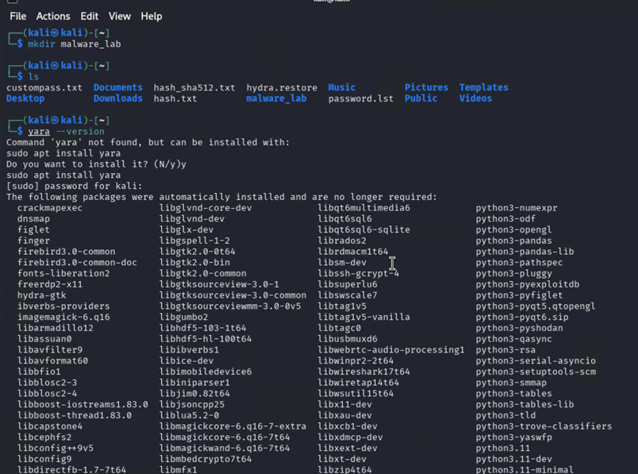
> Figure 1.0

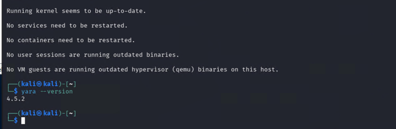
> Figure 1.1

### Step2: Downloading a Malware Sample – MalwareBaazar

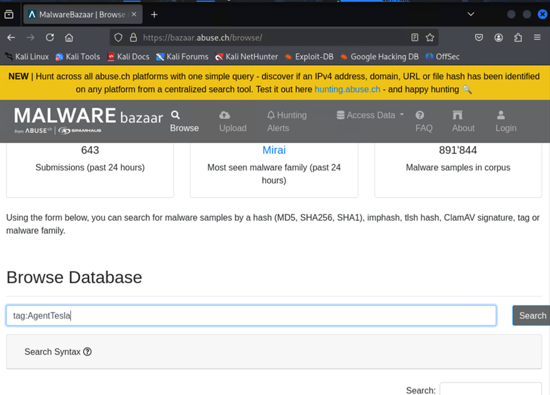
> Figure 1.2

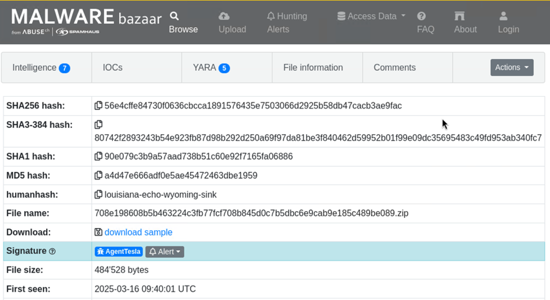
> Figure 1.3

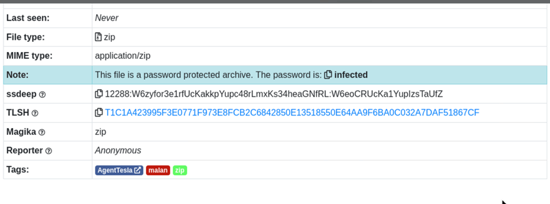
> Figure 1.4

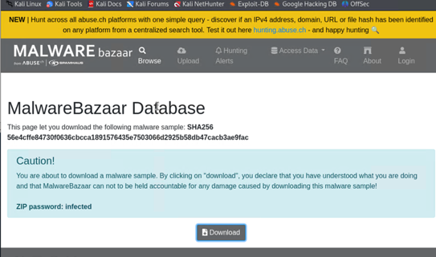
> Figure 1.5

Malware Source: https://bazaar.abuse.ch/sample/56e4cffe84730f0636cbcca1891576435e7503066d2925b58db47cacb3ae9fac/ 

### Step3: Extract the Malware Sample

Commands Used:

`cd` Downloads

`mv` 56e4cffe84730f0636cbcca1891576435e7503066d2925b58db47cacb3ae9fac.zip ~`/malware_lab`

`7z x` 56e4cffe84730f0636cbcca1891576435e7503066d2925b58db47cacb3ae9fac.zip

-pinfected

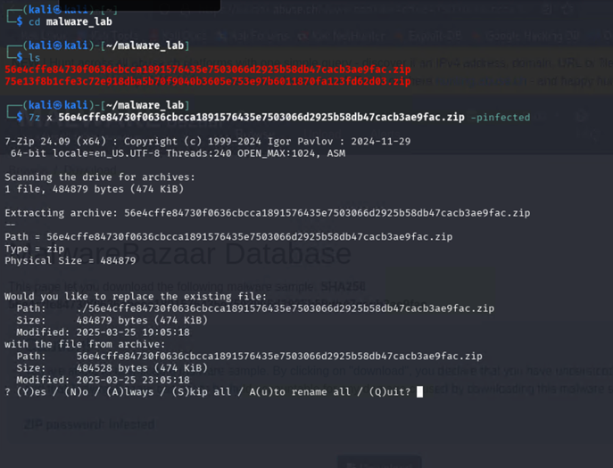
> Figure 1.6

Note: For this screenshot above, I have two malware samples because one of them was empty so I had to download another one.

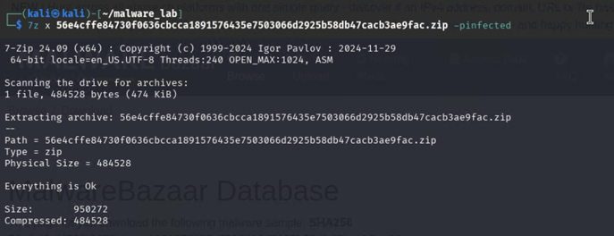
> Figure 1.7

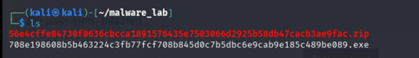
> Figure 1.8

> Figure 1.9

### Step4: Static Malware Analysis with YARA

Commands Used:

`strings` 708e19985a6322c3f7fc7f7088d5dc07b5bdc6e9a9be185fc389eb09.exe | less

`objdump` -x 708e19985a6322c3f7fc7f7088d5dc07b5bdc6e9a9be185fc389eb09.exe | `grep` -i import

`exiftool` 708e19985a6322c3f7fc7f7088d5dc07b5bdc6e9a9be185fc389eb09.exe

`binwalk` 708e19985a6322c3f7fc7f7088d5dc07b5bdc6e9a9be185fc389eb09.exe

`rabin2` 708e19985a6322c3f7fc7f7088d5dc07b5bdc6e9a9be185fc389eb09.exe

`rabin2` -i 708e19985a6322c3f7fc7f7088d5dc07b5bdc6e9a9be185fc389eb09.exe

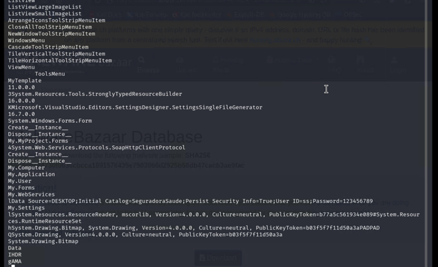
> Figure 2.0

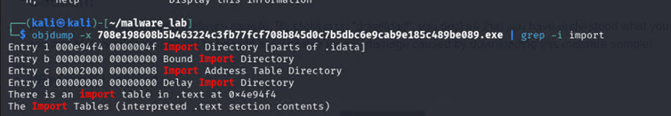
> Figure 2.1

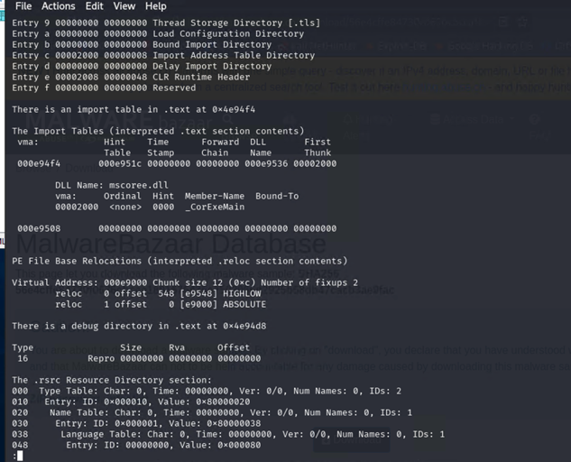
> Figure 2.2

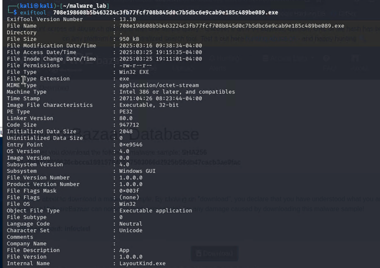
> Figure 2.3

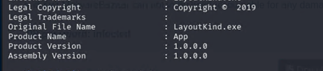
> Figure 2.4

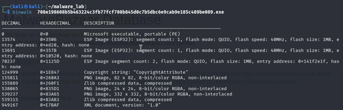
> Figure 2.5

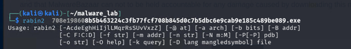
> Figure 2.6

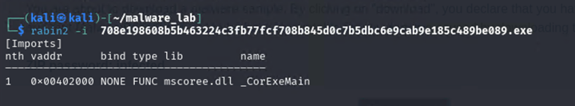
> Figure 2.7

During the analysis of the malware sample using tools such as `objdump` and `rabin2`, I noticed that mscoree.dll is mentioned in both. As I was unsure of what it is, I went ahead and did some research to find out what it is. This is a core component of the Microsoft .NET Framework. It is responsible for loading and initializing the Common Language Runtime (CLR), which is essential for executing .NET applications. Hence, the presence of mscoree.dll confirms that the sample is a .NET application.

Citation: https://www.fortect.com/fix-dll-errors/mscorlib-dll-errors-visual-studio/#:~:text=It%20stands%20for%20Microsoft%20Common,NET%20applications%20rely%20on.  

### Step5: The YARA Rule

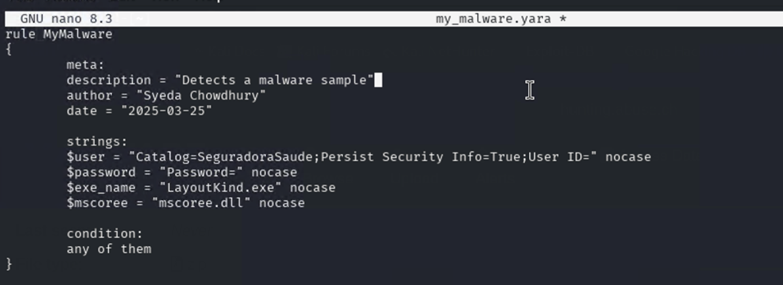
> Figure 2.8

### Step6: Screenshots of running the YARA Against the Malware Sample and YARA Rule file

Commands Used:

`yara` -s my_malware.`yara` 708e19985a6322c3f7fc7f7088d5dc07b5bdc6e9a9be185fc389eb09.exe

`yara` my_malware.`yara` 708e19985a6322c3f7fc7f7088d5dc07b5bdc6e9a9be185fc389eb09.exe

`sha256sum` 708e19985a6322c3f7fc7f7088d5dc07b5bdc6e9a9be185fc389eb09.exe

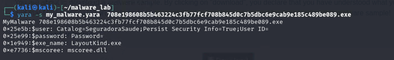
> Figure 2.9

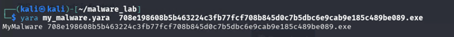
> Figure 3.0

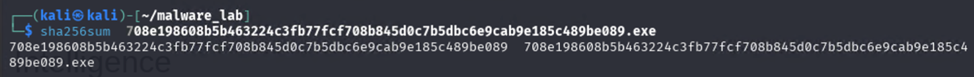
> Figure 3.1

File Name: 708e19985a6322c3f7fc7f7088d5dc07b5bdc6e9a9be185fc389eb09.exe

SHA256 Hash: 708e198608b5b463224c3fb77fcf708b845d0c7b5dbc6e9cab9e185c489be089

## Section 2. Snort:

### Part1:

Commands Used:

`sudo` `apt-get` update

`sudo` `apt-get` install `snort`

`/etc/``snort`/`snort`.conf

`snort` -v

`sudo` `updatedb`

`locate` `snort`.lua

`ip addr`

`sudo` `nano` `/etc/``snort`/`snort`.lua

`ls` `/etc/``snort``/rules`

`sudo` `tar` -xvzf snort3-community-rules.`tar`.gz -c `/etc/``snort``/rules`

`sudo` `snort` -d -l `/var/log/``snort` -h 192.168.0.0`/24` -A console -c `/etc/``snort`/`snort`.lua

`sudo` `snort` -c `/etc/``snort`/`snort`.lua -I eth0 -A console

`sudo` `snort` -c `/etc/``snort`/`snort`.lua -I eth0

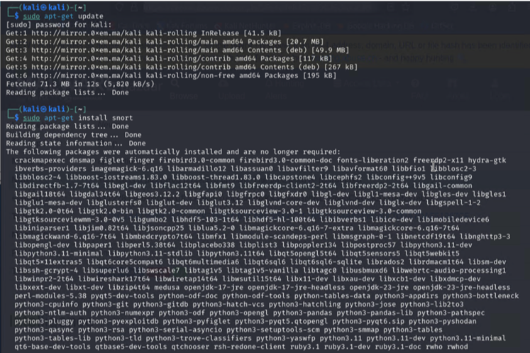
> Figure 3.2

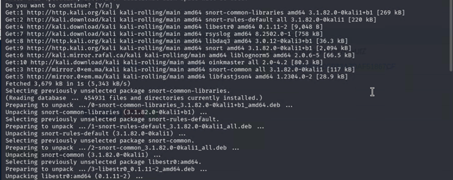
> Figure 3.3

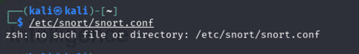
> Figure 3.4

> Figure 3.5

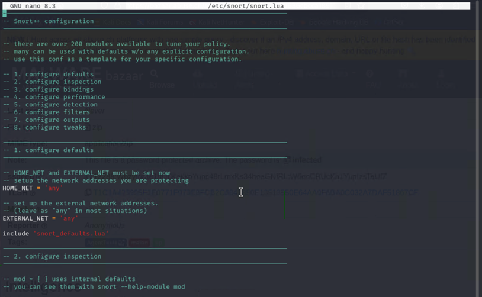
> Figure 3.6

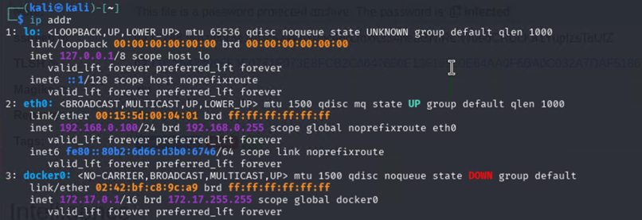
> Figure 3.7

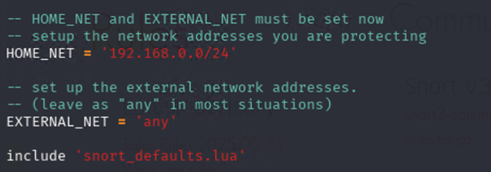
> Figure 3.8

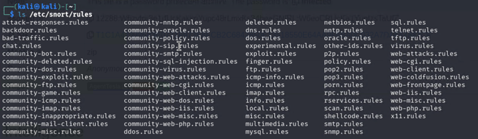
> Figure 3.9

> Figure 4.0

> Figure 4.1

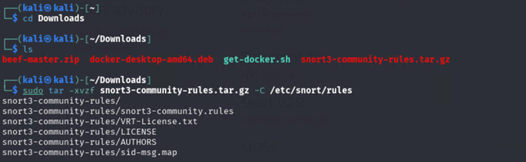
> Figure 4.2

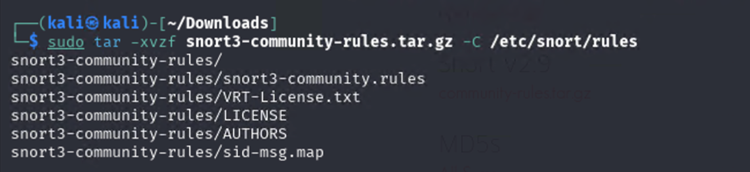
> Figure 4.3

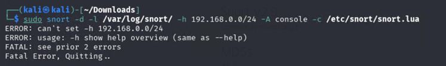
> Figure 4.4

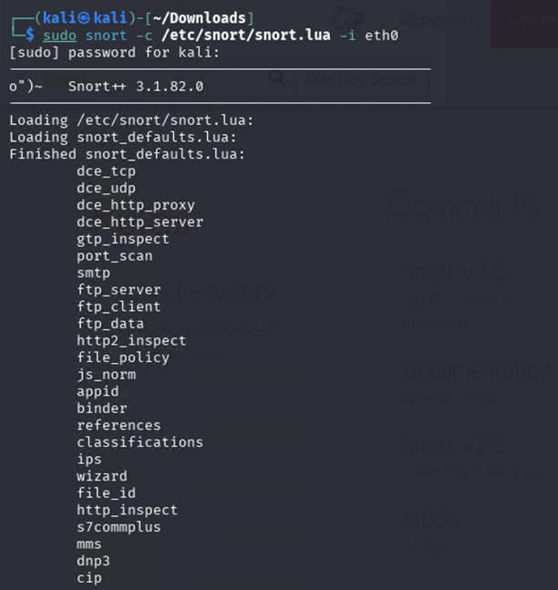
> Figure 4.5

> Figure 4.6

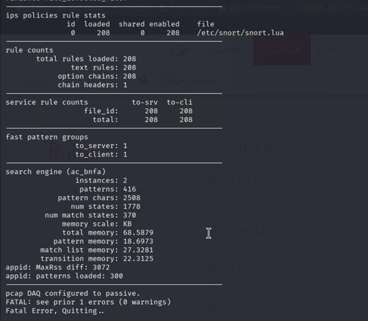
> Figure 4.7

> Figure 4.9

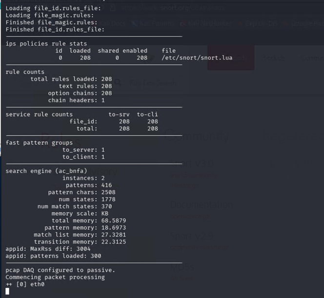
> Figure 5.0

### Conclusion:

Commands used to get here as shown in figures 4.4 and 4.5:

`sudo` `snort` -c `/etc/``snort`/`snort`.lua -i eth0 -A console

However, after starting the process, I ran into fatal errors as shown in figure 4.4.

Error message includes unknown logger console. This is due to -A console option not being recognized.

Hence, to resolve this issue, I removed the ‘-A console’ to test if it works and it worked as shown in figure 4.5.

-c `/etc/``snort`/`snort`.lua tells `snort` to read the `snort` config file located at `/etc/``snort`/`snort`.lua

-i eth0 tells the network eth0 that `snort` should monitor

-A console is used to direct `snort` to output alerts to the console

### Part 2:

Commands Used:

`sudo` `nano` `/etc/``snort``/rules/local.rules`

`sudo` `nano` `/etc/``snort`/`snort`.lua

`sudo` `snort` -c `/etc/``snort`/`snort`.lua -R `/etc/``snort``/rules/local.rules` -i eth0 -l `/var/log/``snort`/

`ping` 192.168.0.105

`sudo` `cat` `/var/log/``snort``/alert_fast.txt`

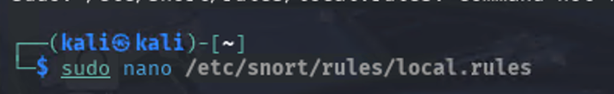
> Figure 5.1

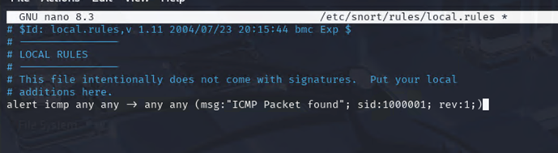
> Figure 5.2

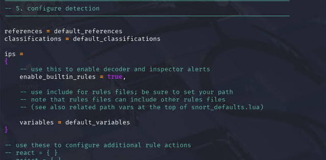
> Figure 5.3

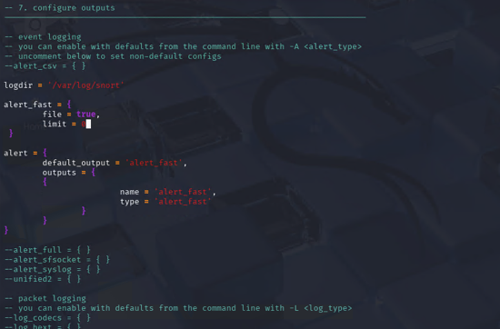
> Figure 5.4 Modfied the snort.lua file to direct the trigger logs into alert_fast.txt file in /var/log/snort directory

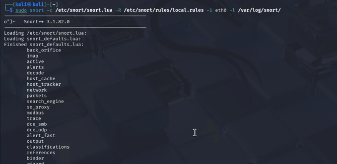
> Figure 5.5

Here `sudo` `snort` -c `/etc/``snort`/`snort`.lua ran the command in root and specifies the config file for `snort`.lua.

-R `/etc/``snort``/rules/local.rules` loaded the custom rule file that I had initially implemented for trigger testing.

i eth0 tells `snort` to monitor traffic on the specific interface

l `/var/log/``snort`/ is used to set to directory where the `snort` will write its logs

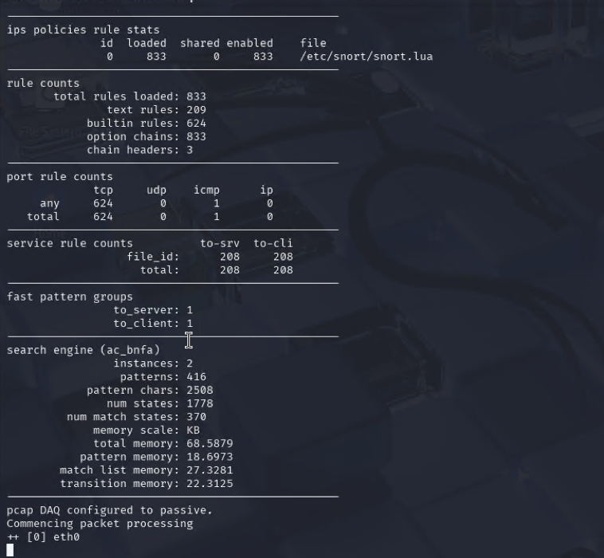
> Figure 5.6

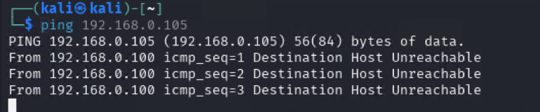
> Figure 5.7

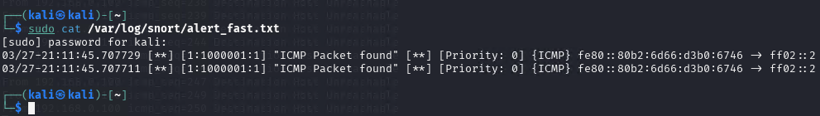
> Figure 5.8 Successfully triggered snort with pinging 192.168.0.105

### Part 3:

Commands Used:

`sudo` `snort` -c `/etc/``snort`/`snort`.lua -R `/etc/``snort``/rules/local.rules` -A alert_fast

`sudo` `nano` `/etc/``snort``/rules/local.rules`

`sudo` `cat` `/var/log/``snort``/alert_fast.txt`

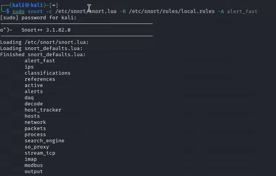
> Figure 5.9

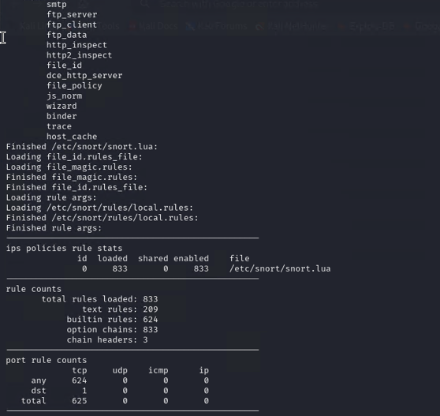
> Figure 6.0

> Figure 6.1

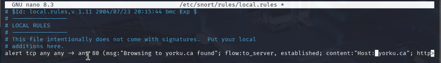
> Figure 6.2 Set up custom rules to trigger when browsing to the web yorku.ca (pt1)

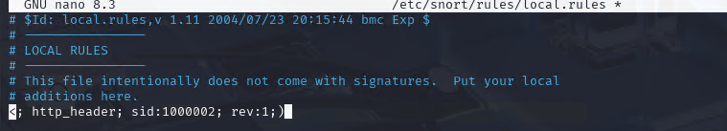
> Figure 6.3 Setting up custom rules to trigger when browsing to the web yorku.ca (pt2)

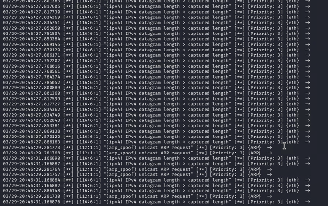
> Figure 6.4 Got this with the command sudo cat /var/log/snort/alert_fast.txt after browsing to www.yorku.ca from Firefox; Unsuccessful with the trigger. 

### Conclusion:

Unsuccessful with the trigger as it doesn’t show anything on “Browsing yorku.ca found” as shown in figure 6.4. I tried `sudo` `grep` “Browsing yorku.ca found” `/var/log/``snort``/alert_fast.txt` command as troubleshoot and found no result. Also made sure my network card was on promiscuous mode by command `sudo` `ip link set` eth0 `promisc` on as an extra troubleshooting step still found no success in triggering the www.yorku.ca browser.