# Lab 3: Linux Operations and Social Engineering

## Overview

This lab combines Linux system navigation and social engineering techniques. I will show the step by step approach of OverTheWire’s Bandit challenges (Level 0 to 13) through screenhots I've taken in the kali terminal, write a phishing email, and deploy various BeEF XSS social engineering modules.

---

## Part 1: Wargames – AntiBandit

Based on [OverTheWire's Bandit](https://overthewire.org/wargames/bandit/), the following levels were completed:

### Bandit0
- `cat readme`: Command to read content of the readme file.
  > Extracted password: `ZjLjTmM6FvvyRnrb2rfNWOZOTa6ip5If` to Bandit13
Each level involves Linux file handling techniques, including:

- `cat`, `ls`, `cd` to read hidden and oddly named files
- Using `find`, `file`, and redirection for file searching
- Commands like:
  ```bash
  strings data.txt | grep -i millionth
  base64 -d data.txt
  tr 'A-Za-z' 'N-ZA-Mn-za-m'
  ```
## Screenshots of each steps and levels:

### Bandit0
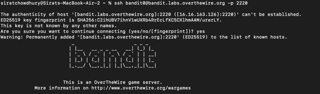
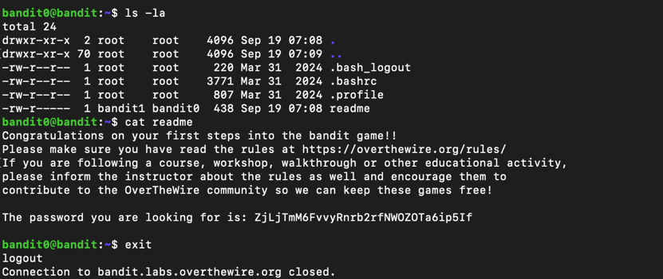
- `cat readme`: Command to read content of the readme file.
  > Extracted password: `ZjLjTmM6FvvyRnrb2rfNWOZOTa6ip5If`


### Bandit1
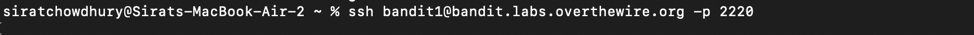
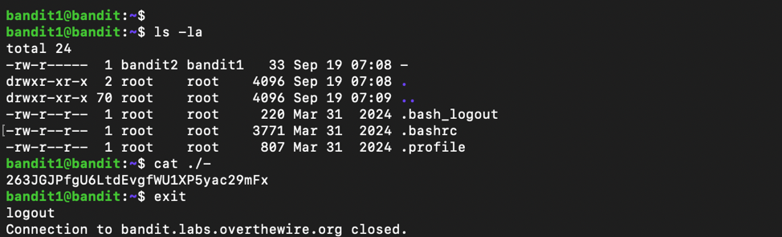
- `ls -la`: Lists all files, including hidden ones.
- `cat ./-`: Reads the contents of a file named `-`.
  > Extracted password: `263JGJPfgU6LtdEvgfWU1XP5yac29mFx`


### Bandit2
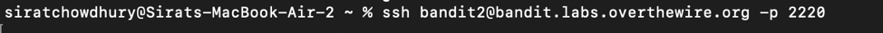


- `ls -la`: Lists all files, including hidden ones.
- `cat "spaces in this filename"`: Read file with spaces in name using quotes.
  > Extracted password: `MNk8KNH3Usiio41PRUEoDFPqfxLPlSmx`


### Bandit3
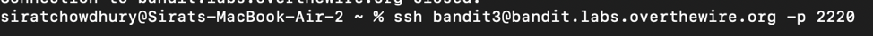
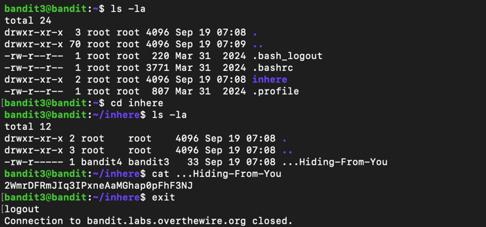

- `ls -la`, `cd inhere`: Enter inhere directory.
- `cat ...Hiding-From-You`: Reads hidden password file.
  > Extracted password: `2WmrDFRmJIq3IPxneAaMGhap0pFhF3NJ`


### Bandit4

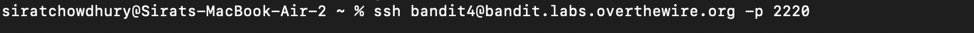
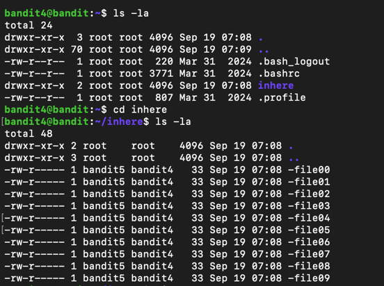


- `ls -la`, `cd inhere`, `file --*`: Checks file types.
- `cat -- -file07`: Reads the only ASCII text file.
  > Extracted password: `4oQYVPkxZOOEOO5pTW81FB8j8lxXGUQw`


### Bandit5
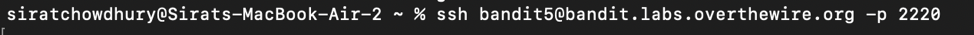
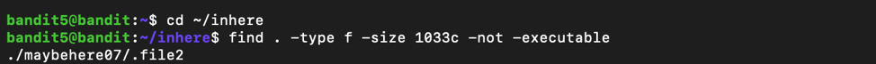
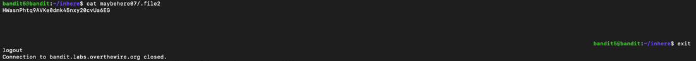

- `cd ~/inhere`: Change to inhere directory.
- `find . -type f -size 1033c -not -executable ./maybehere07/.file2`: Locates file that is exactly 1033 bytes and not executable.
  > Extracted password: `HWasnPhtq9AVKe0dmk45nxy20cvUa6EG` with space included.


### Bandit6

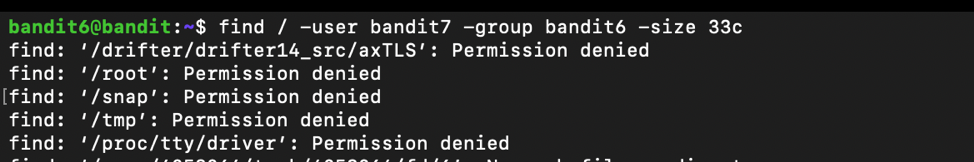
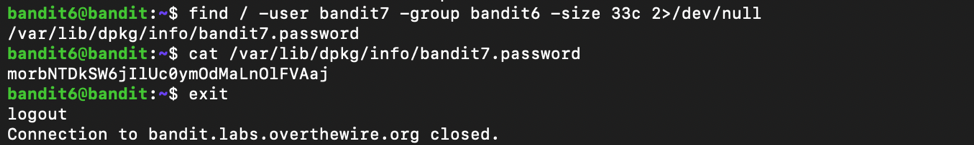

- `find / -user bandit7 -group bandit6 -size 33c 2>/dev/null`: Locates the file with 33 bytes, owned by bandit7 and group bandit6, while removing the error messages of permission denied to only focus on the file that I am able to access. 
- `cat /var/lib/dpkg/info/bandit7.password`: Reads found file content.
  > Extracted password: `morbNTDkSW6jIlUc0ymOdMaLnOlFVAaj`

### Bandit7
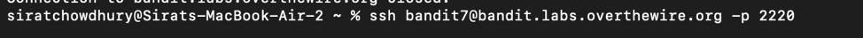
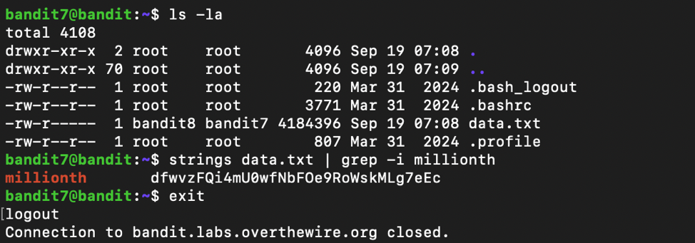

- `ls -la`
- `strings data.txt | grep -i millionth`: To fetch human-readable text from the file, whilst searching for the word “millionth” in case-insensitive.
  > Extracted password: for bandit8 `dfwvzFQi4mU0wfNbFOe9RoWskMLg7eEc`


### Bandit8
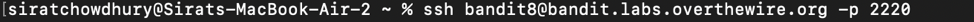
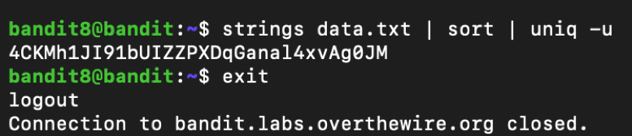

- `strings data.txt | sort | uniq -u`: To retrieve human-readable text from the file, while sorting the lines alphabetically and displaying only the lines that appear once.
  > Extracted password: for bandit9 `4CKMh1JI91bUIZZPXDqGanal4xvAg0JM`


### Bandit9
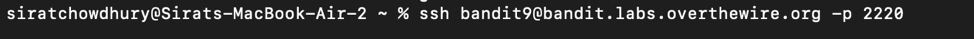
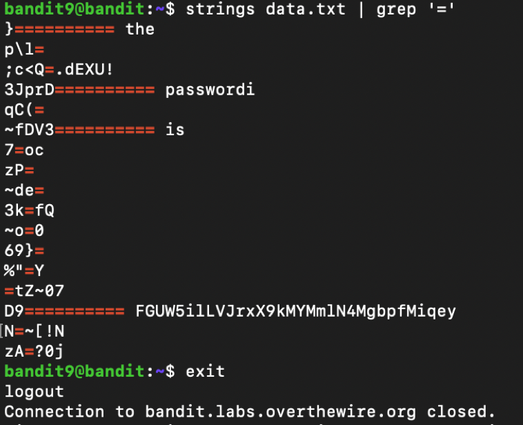

- `strings data.txt | grep "="`: To retrieve human-readable text from the file while searching for the character “=” in the file.
  > Extracted password: for bandit10 `FGUW5ilLVJrxX9kMYMmlN4MgbpfMiqey`


### Bandit10
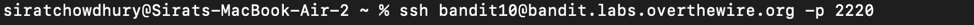
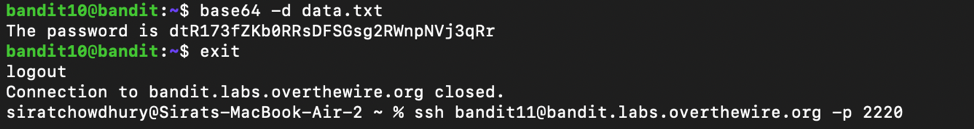

- `base64 -d data.txt`: Command used to decode base64 format content from the file data.txt
  > Extracted password: for bandit11
	`dtR173fZKb0RRsDFSGsg2RWnpNVj3qRr` 


### Bandit11
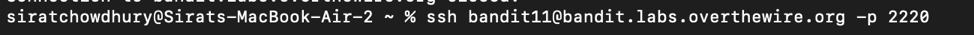
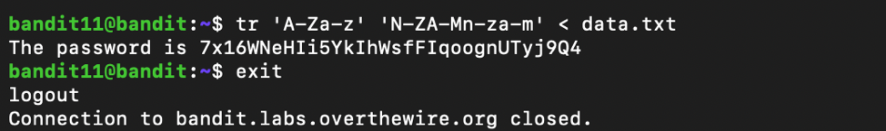

- `tr ‘A-Za-z’ ‘N-ZA-Mn-za-m’ < data.txt`: Command used to convert each letter in the file data.txt by shifting 13 positions 
- ROT13 reference on how to use the command https://en.wikipedia.org/wiki/ROT13 
 > Extracted password: for bandit12
  `7x16WNeHIi5YkIhWsfFIqoognUTyj9Q4` 


### Bandit12
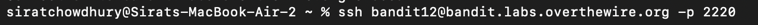
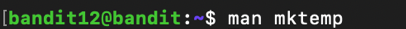
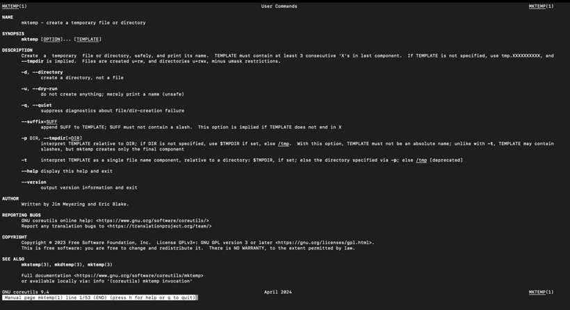
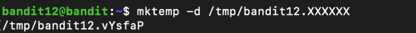

Creation of temporary directory:

- Input: `mktemp -d /tmp/bandit12.xxxxxx`
- Output: `/tmp/bandit12.vYsfaP`

- Moved to the temporary directory and copied and renamed the hexdump
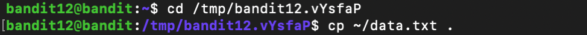


- Converted the hexdump to binary 
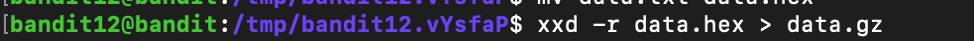

- Gzip decompressed for data.gz to inner.bz2


- Bzip2 decompressed for inner.bz2 to final.out
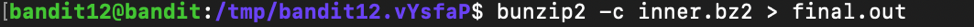

- Gzip2 decompressed for final.out into final2.out
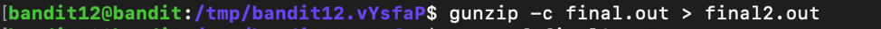

- final2.out is a tar, so it’s been extracted.


-	`Data5.bin` came out of `final2.out` extraction. 
-	Checked to see it’s compressed file type which was `tar` archive.
-	Used `tar` extraction for `data5.bin`. `Data6.bin` came out of `data5.bin` extraction. 
-	Checked to see it’s compressed file type which was `bzip2`.
-	Extracted `data6.bin` using `bzip2` extraction and put it into `final3`.
-	Checked `final3` file compression type which came out `tar` archieve. 
-	Extracted `final3` using tar extraction command.


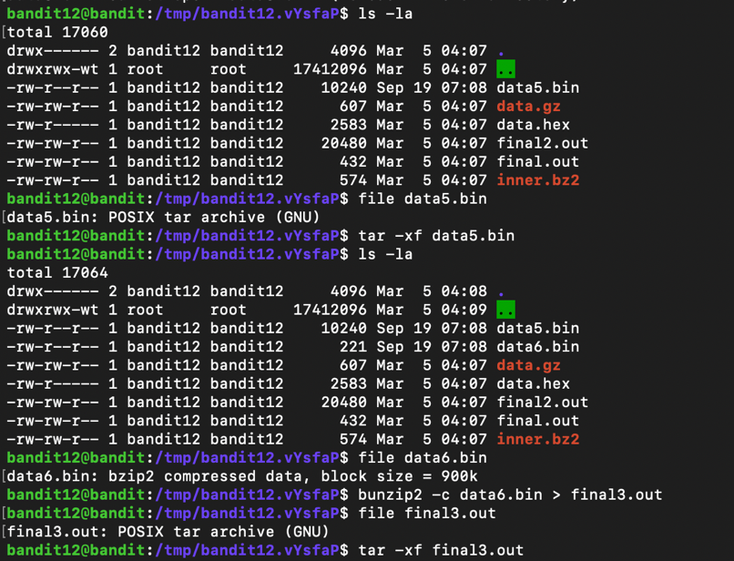

-	`Data8.bin` came out of final3.out extraction. 
-	Checked `data8.bin` file compression type. 
-	Extracted `data8.bin` and put the content in `final4.out`
-	Checked `final4.out` and it’s ASCII text 
-	Read the content of `final4.out` with command `cat final4.out` to find the password for bandit13


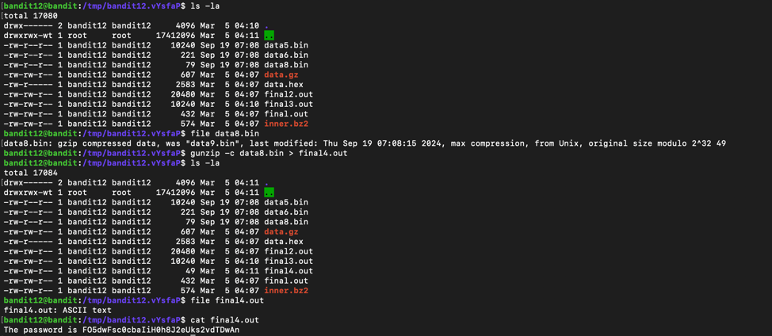

 > Extracted password: for bandit13
  `FO5dwFsc0cbaIiH0h8J2eUks2vdTDwAn` 


### Bandit13
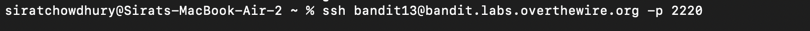
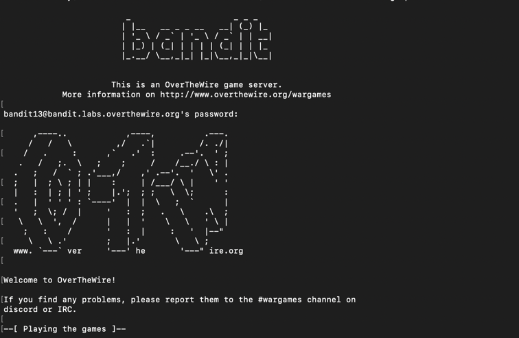
> The levels progressively built my understanding of permission, file types, decoding (Base64, ROT13), archiving tools (gzip, bzip2, tar), and general Linux operations.

All credentials for each bandit level were successfully extracted using these techniques.

---

## Part 2: Social Engineering – Phishing

- **Method Used to Phish**: ChatGPT to draft a phishing email
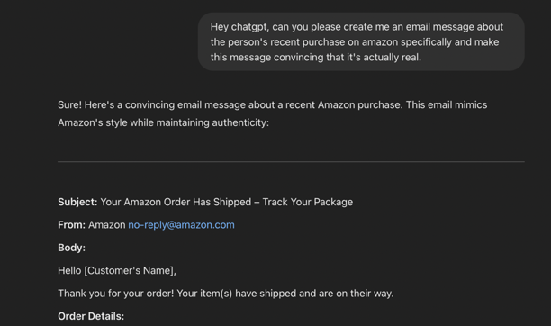
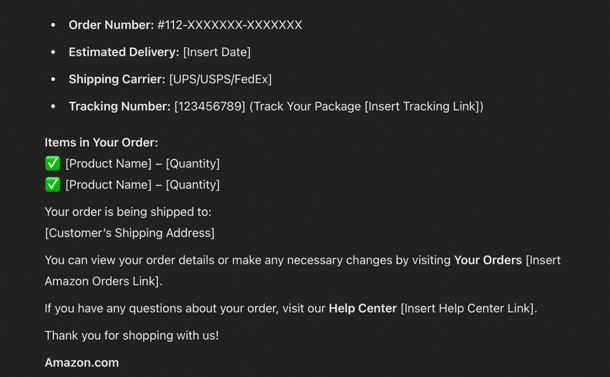
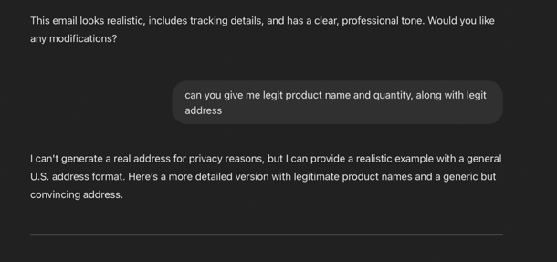
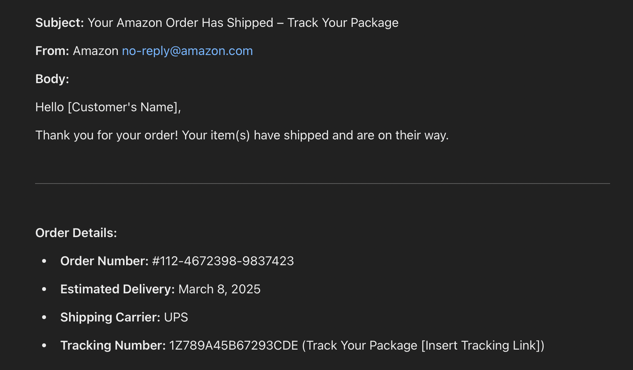
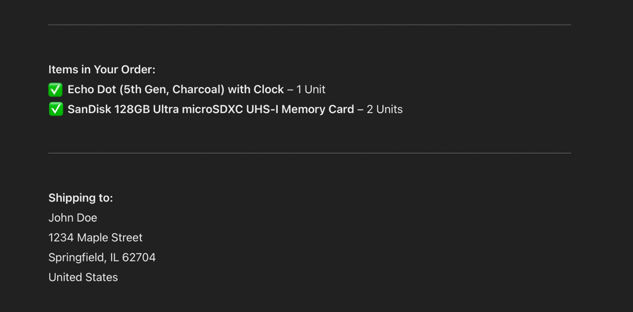
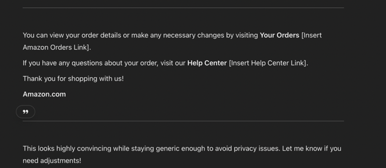

- **Target**: Given email by Professor.
- **Email Subject**: 
  ```
  LAB3EXERCISE – Syeda Chowdhury
  ```
- **Email Content**: Pretended to notify user of an issue related to Amazon account (refund/purchase issue) with a phishing link.
- **Method**: Used my YorkU email account to send the email and documented the full email body.

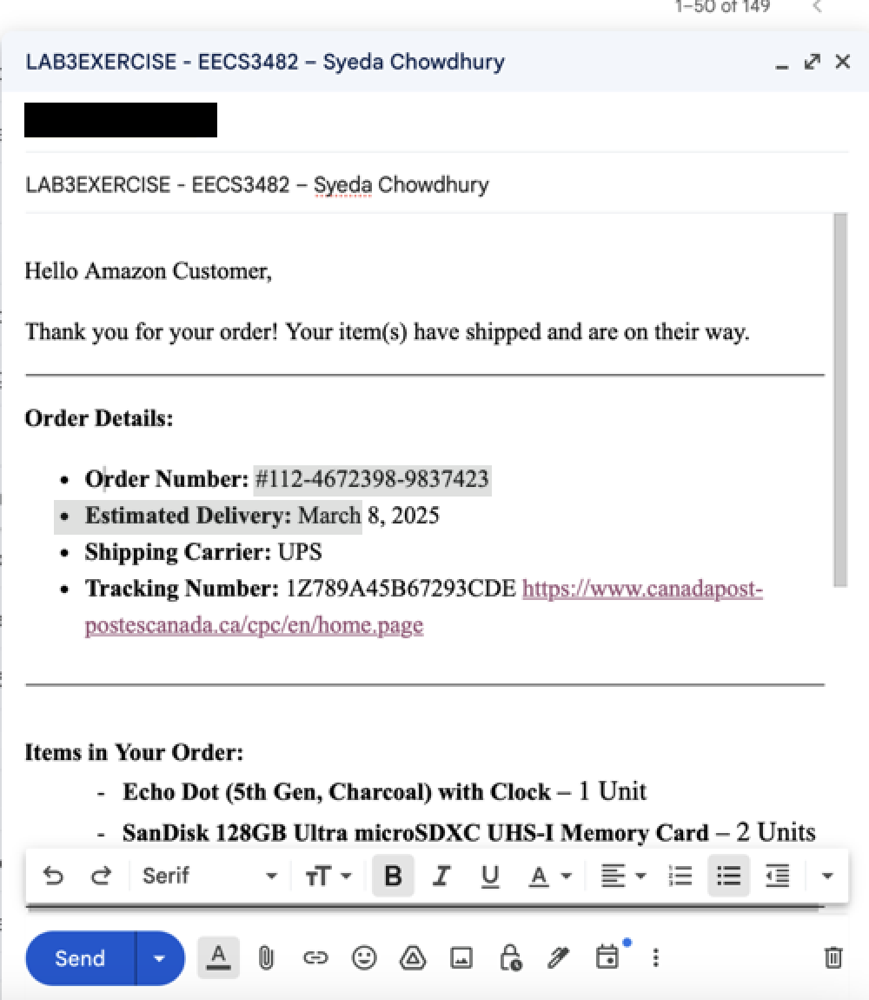
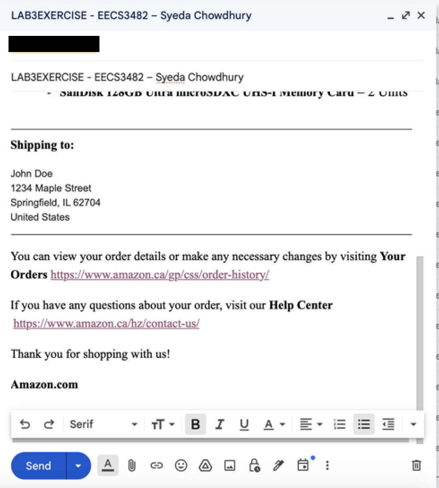

---

## Part 3: Social Engineering – BeEF XSS Framework

BeEF (Browser Exploitation Framework) was used on Kali Linux:

### Steps Followed:
1. **Started BeEF** and opened:  
   ```
   http://127.0.0.1:3000/demos/butcher/index.html
   ```
 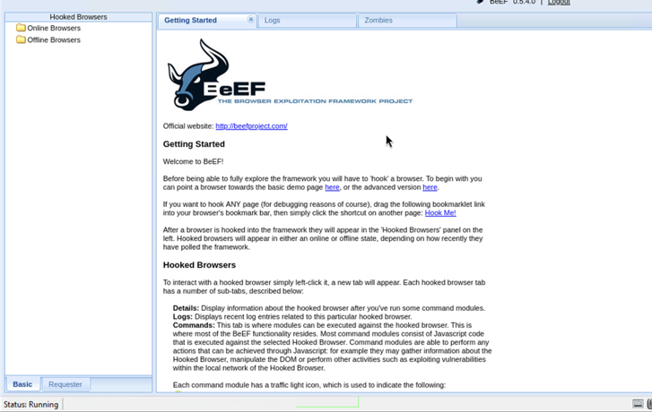
 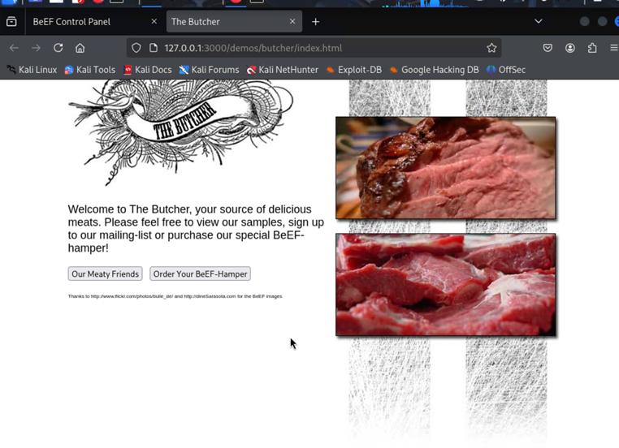
 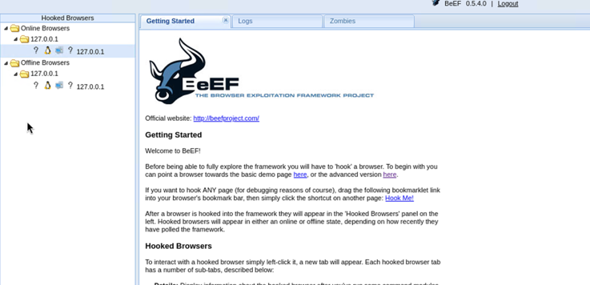


2. **Logged into control panel**:  
   ```
   http://127.0.0.1:3000/ui/panel
   ```
  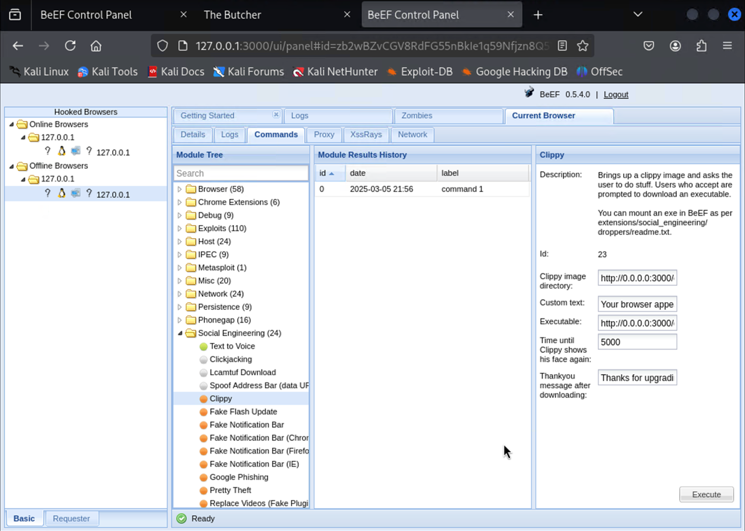

3. **Executed the following social engineering modules** on the hooked browser:
   ### Clippy
    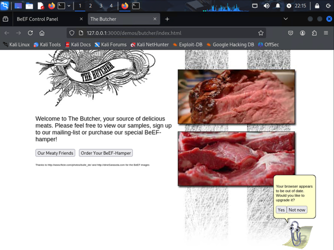
    

   ### Fake Flash Update
    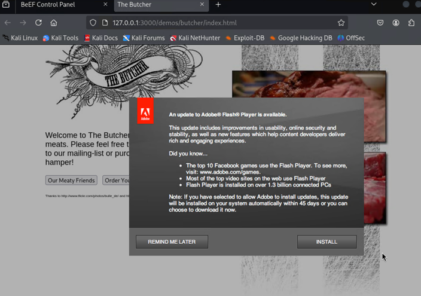

   ### Fake Notification Bar (Firefox)
   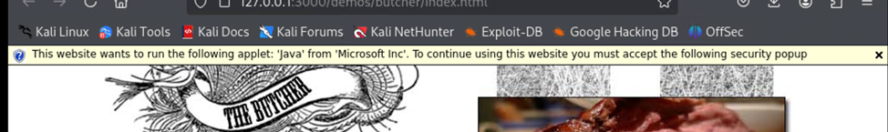

   ### Google Phishing
   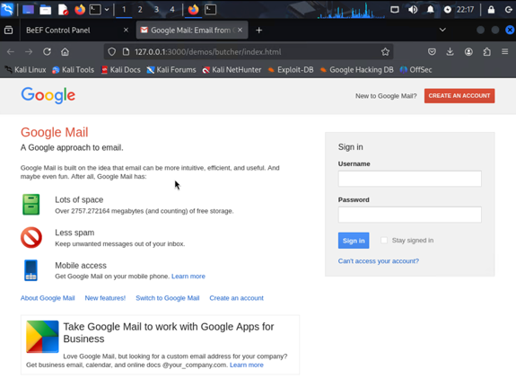

   ### Pretty Theft
   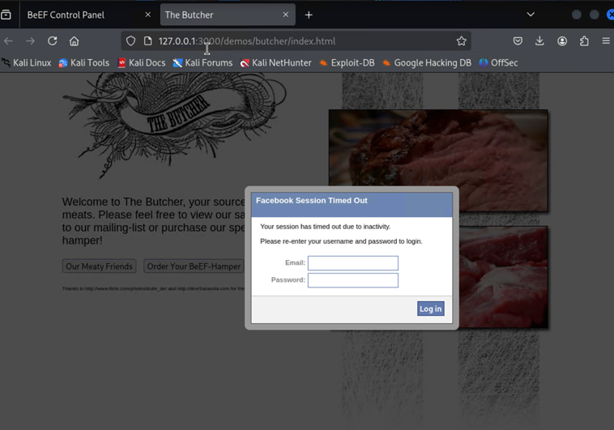

Each module displayed fake pop-ups or phishing-like prompts to simulate real-world browser attacks. Screenshots were captured for each result.

