# Password Management

## Overview

This lab explores password cracking techniques using **John the Ripper (JtR)** and **Hydra**, simulating real-world security auditing methods. Tasks involve cracking hashed passwords from the shadow file and brute-forcing SSH logins using different technics.

---

## Part 1: John the Ripper

### Step 1 & 2: Installing JtR

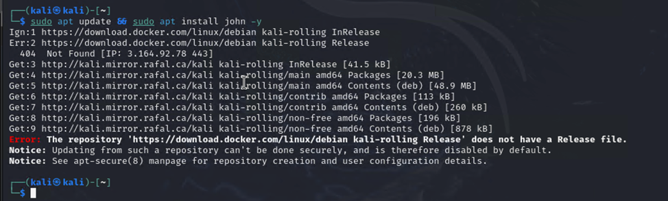
> Figure 1.1 Attempt to install John the Ripper


> Figure 1.2 Error received when installing JtR

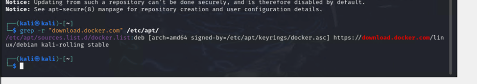
> Figure 1.3


- Resolved Docker conflicts with:
  ```bash
  sudo rm /etc/apt/sources.list.d/docker.list
  sudo apt update && sudo apt install john -y
  ```
> Removed conflicting Docker repo and installed John the Ripper using apt. Why? because Docker repository was interfering with the JtR installation.

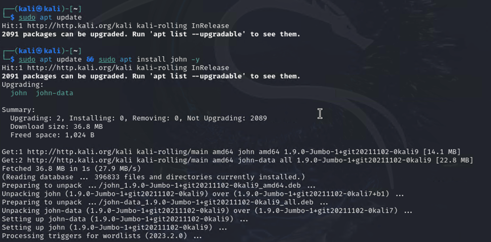
> Figure 1.4 Successful installation of JtR 

---

### Step 3–7: User Creation and Hash Extraction
```bash
sudo useradd test
sudo passwd test
sudo grep test /etc/shadow > hash.txt
cat hash.txt
```
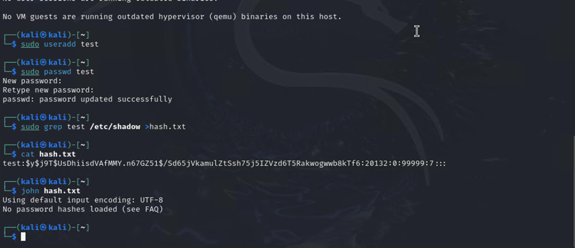
> Figure 1.5 Created a test user, set the password, redirected the password hash into `hash.txt`.

```bash
john hash.txt
```
> Ran JtR to crack the password. Encountered format error with yescrypt hashes.

---

### Error Solution:
Edited PAM config to change from `yescrypt` to `sha512`, created `test2`, and re-extracted to `hash_sha512.txt`, then cracked successfully:
```bash
sudo nano /etc/pam.d/common-password
john hash_sha512.txt
```
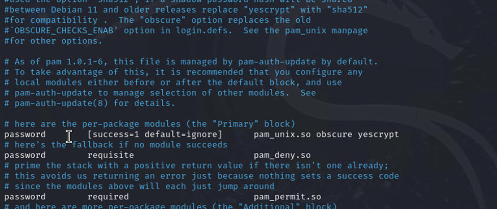
> Figure 1.6 

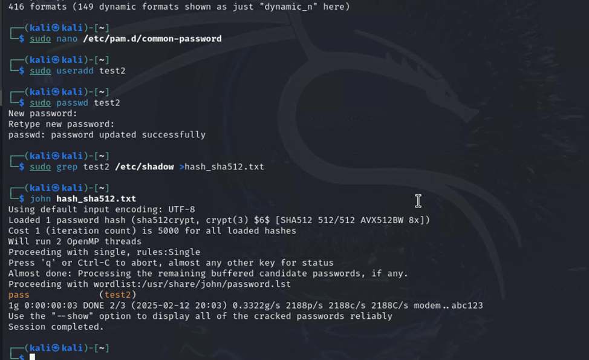
> Figure 1.7

---

### Step 9: Format Attempt
```bash
john --format=crypt hash_sha512.txt
john --format=crypt hash_sha512.txt --show
```
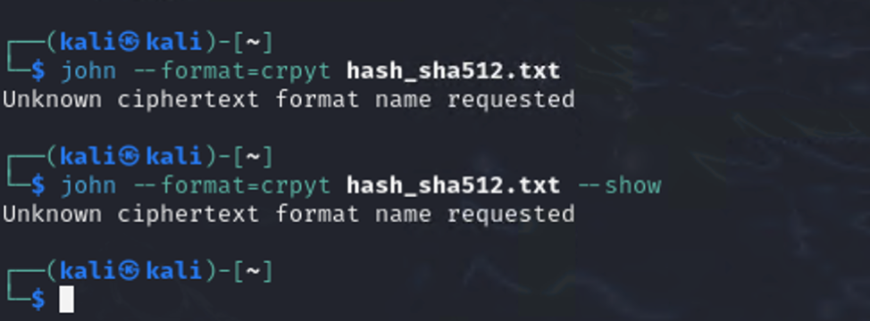
> Figure 1.8 Error: `--format=crypt` didn’t work; automatic detection worked instead.


---

### Step 10: Dictionary Attack
```bash
ls /usr/share/wordlists
zcat rockyou.txt.gz > rockyou.txt
john --wordlist=/usr/share/wordlists/rockyou.txt hash_sha512.txt
```
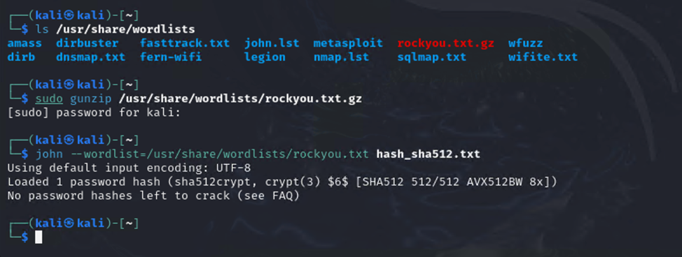
> Figure 1.9

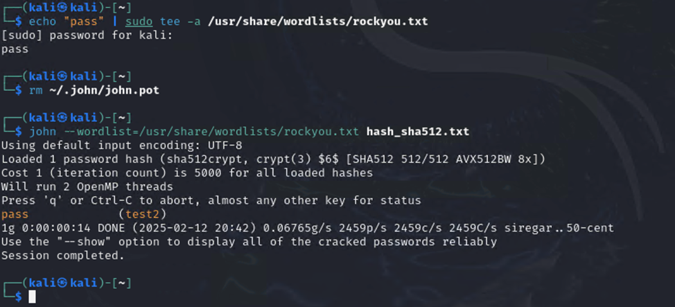
> Figure 1.10 Added password to dictionary and cracked it in 14 seconds.

---

### Step 11: Length-based Brute Force
```bash
john --incremental=Alnum --min-length=2 --max-length=12 hash_sha512.txt
```
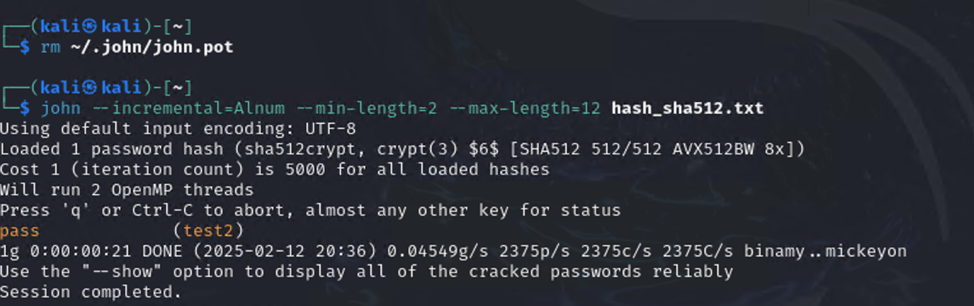
> Figure 1.11  Ran a brute-force attack for passwords 2 to 12 chars long. Took ~21 seconds.

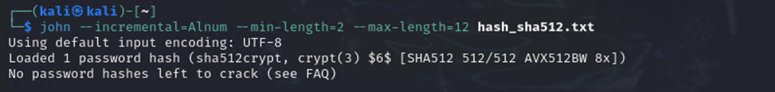
> Figure 1.12 

---

## Part 2: Hydra (SSH Cracking)

### Step 1–3: SSH Setup and Connection
```bash
ssh vagrant@192.168.0.102
```
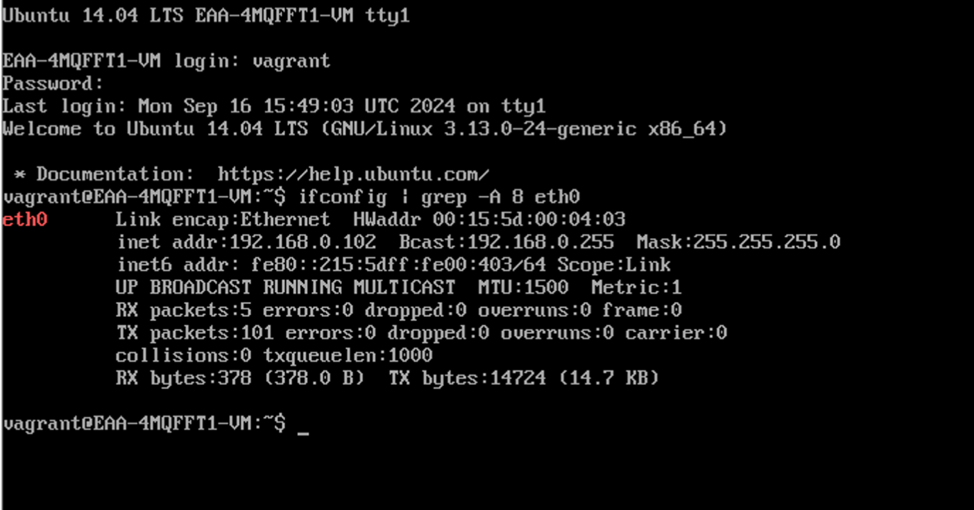
> Figure 2.1 in Metasploitable3

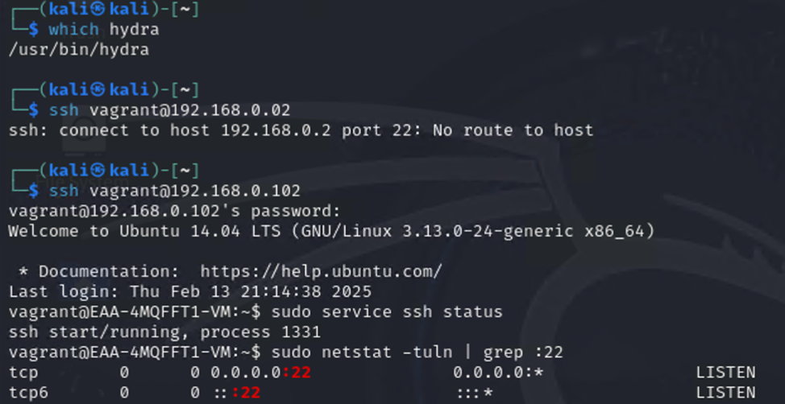
> Figure 2.2 in Kali, connecting to port 22 using SSH

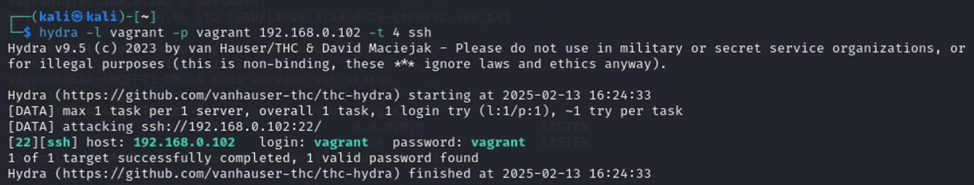
> Figure 2.3 Verifying access of the SSH server 
> Connected to SSH server on Metasploitable3.

---

### Step 5–6: Hydra Basic Attack
```bash
hydra -l vagrant -p admin 192.168.0.102 -t 4 ssh
```
> `-l vagrant` means username vagrant 
> `-p` admin means password admin 
> `192.168.0.102` is the target for Metasploitable3 IP
> `-t 4` is the number of parallel attack threads. 
> `ssh` means we are using SSH to attack (over the network)

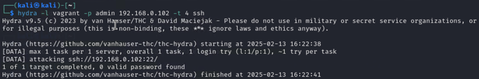
> Figure 2.4 

> Tried brute-force with known user/pass. Result: 0 valid passwords. 

> Solution: `vagrant` is the correct password for username vagrant as shown in figure 2.3.

---

### Step 7–8: Wordlist-based Hydra Attack
```bash
hydra -l vagrant -P password.lst 192.168.0.102 -t 4 ssh
```
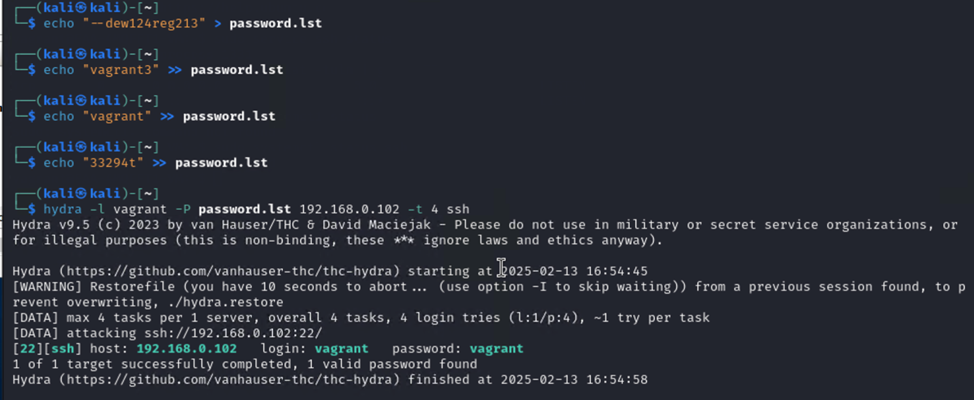
> Figure 2.5 

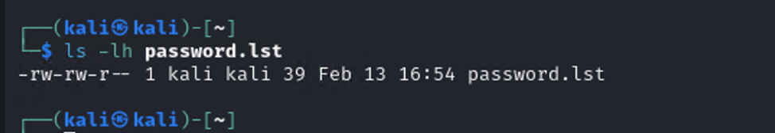
> Figure 2.6 
> Cracked password using `password.lst` (39 bytes, 4 entries). Took 13 seconds. The password was `vagrant`. 

---

### Step 9: Hydra vs John the Ripper
- **Hydra** targets live network services (e.g., SSH).
- **JtR** cracks offline password hashes.
- Hydra’s attacks depend on network speed, while JtR depends on system CPU.

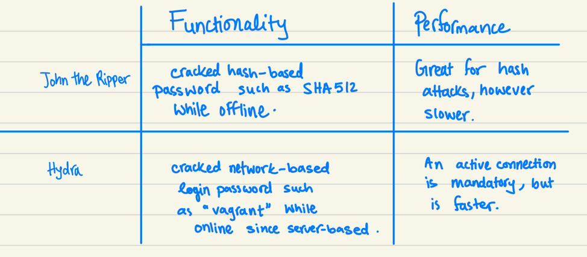
> Figure 2.7 

---

## Part 3: Research & Exploration

### 1. Aside from JtR and Hydra, one more tool related to brute force attacks and password cracking and its main difference compared to JtR and Hydra:

- **Intruder (Burp Suite)** is another brute-force tool focused on web applications.

### 2. The difference between dictionary attack and brute force attack:

- **Brute Force**: Tries all combinations.
- **Dictionary Attack**: Uses a predefined list.

### 3. Mitigation steps to take to prevent brute force and dictionary attacks:

  - Enforce strong passwords
  - Implement account lockouts
  - Enable MFA (Multi-Factor Authentication)

