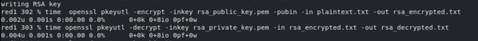

# Symmetric and Asymmetric Cryptography

## Overview
This lab focuses on implementing and analyzing cryptographic operations using both symmetric (AES) and asymmetric (RSA) methods. The tasks were completed using OpenSSL and Python, demonstrating key generation, encryption/decryption, digital signatures, and performance evaluation.

---

## Part 1: Symmetric Encryption (AES)

### 1. Key Generation & Encryption

- **Generate 256-bit symmetric key:**
  ```bash
  openssl rand -base64 32 > symmetric_key.key
  ```
  > This generates a secure 256-bit (32-byte) random key encoded in Base64 and saves it to a file.

- **Verify the key:**
  ```bash
  cat symmetric_key.key
  ```
  > Displays the content of the generated key to confirm it was created correctly.

- **Create plaintext:**
  ```bash
  echo "Syeda Chowdhury" > plaintext.txt
  ```
  > Creates a text file containing my full name as required for encryption.

- **Encrypt using AES-256-CBC:**
  ```bash
  openssl enc -aes-256-cbc -salt -pbkdf2 -in plaintext.txt -out encrypted_file.enc -pass file:symmetric_key.key
  ```
  > Encrypts the plaintext file using AES in CBC mode with 256-bit key strength, salt for randomness, and PBKDF2 for secure password-based key derivation.

> **Q1: What does `-salt` do?**  
> It adds randomness to key derivation, ensuring different ciphertexts for the same plaintext and key, hence improving security.

---

### Decryption

- **Decrypt the file:**
  ```bash
  openssl enc -d -aes-256-cbc -pbkdf2 -in encrypted_file.enc -out decrypted_file.txt -pass file:symmetric_key.key
  ```
  > Decrypts the previously encrypted file using the same AES parameters and key.

- **Verify decryption:**
  ```bash
  cat decrypted_file.txt
  diff plaintext.txt decrypted_file.txt
  ```
  > `cat` displays the decrypted content, and `diff` confirms if it matches the original plaintext file.

> **Q2: What happens with the wrong key?**  
> Decryption fails with an "error getting password" message and no output is produced.

---

### Performance & Key Size Comparison

- **Encrypt with different AES key sizes:**
  ```bash
  time openssl enc -aes-128-cbc -pbkdf2 -in plaintext.txt -out enc128.enc -pass file:symmetric_key.key
  time openssl enc -aes-192-cbc -pbkdf2 -in plaintext.txt -out enc192.enc -pass file:symmetric_key.key
  time openssl enc -aes-256-cbc -pbkdf2 -in plaintext.txt -out enc256.enc -pass file:symmetric_key.key
  ```
  > Measures how encryption time changes across 128-bit, 192-bit, and 256-bit key sizes using the `time` command.

> **Q3: Encryption time vs. key size?**  
> - 128-bit (7ms) – Fastest, but weakest  
> - 192-bit (15ms) – Slowest  
> - 256-bit (13ms) – Strongest; surprisingly faster than 192-bit in testing

---

## Part 2: Asymmetric Encryption (RSA)

### 1. Key Pair Generation

```bash
openssl genrsa -out private_key.pem 2048
openssl rsa -pubout -in private_key.pem -out public_key.pem
```
> Generates a private RSA key (2048-bit) and derives the corresponding public key for encryption and verification.

- **Verify keys:**
  ```bash
  cat private_key.pem
  cat public_key.pem
  ```
  > Displays the keys to verify successful creation.

---

### 2. Encrypt & Decrypt File

- **Encrypt with public key:**
  ```bash
  openssl pkeyutl -encrypt -inkey public_key.pem -pubin -in plaintext.txt -out rsa_encrypted.txt
  ```
  > Encrypts the plaintext file using the public RSA key so only the private key can decrypt it.

- **Decrypt with private key:**
  ```bash
  openssl pkeyutl -decrypt -inkey private_key.pem -in rsa_encrypted.txt -out rsa_decrypted.txt
  ```
  > Decrypts the RSA-encrypted file using the private key.

- **Verify:**
  ```bash
  diff plaintext.txt rsa_decrypted.txt
  ```
  > Confirms whether the decrypted file matches the original input.

> **Q4: Why is RSA slower than AES?**  
> RSA uses more complex math and larger key sizes (2048-bit) than AES. While no major difference was noticed for small files, the difference becomes clear with larger data.

## Screenshots of RSA & AES respectively:




---

### 3. Digital Signatures

- **Sign file with private key:**
  ```bash
  openssl dgst -sha256 -sign private_key.pem -out signature.bin plaintext.txt
  ```
  > Creates a SHA-256 hash of the file and signs it using the private key, ensuring the file’s integrity and authenticity.

- **Verify signature with public key:**
  ```bash
  openssl dgst -sha256 -verify public_key.pem -signature signature.bin plaintext.txt
  ```
  > Verifies the digital signature using the public key and ensures the file has not been tampered with or in other words, modified.

> **Q5: What is hashing's role in signatures?**  
> Hashing ensures integrity. Only the hash (not full file) is signed. During verification, the hash is re-calculated and compared to ensure authenticity and integrity.

---

## Part 3: Python AES Encryption Client (encrypt.py)

This Python program demonstrates **AES-128 encryption in CBC mode** with proper key and IV generation, PKCS7 padding, and base64 encoding. 

1. The original plaintext  
2. The encrypted text in Base64  
3. The decrypted string (should match the original)

---

### Coding Breakdown:

```python
import os
from cryptography.hazmat.primitives import padding
from cryptography.hazmat.primitives.ciphers import Cipher, algorithms, modes
import base64
from cryptography.hazmat.backends import default_backend
```
> Imports required libraries for cryptography, padding, AES cipher configuration, and base64 encoding.

---

#### `encrypt(plaintext, key, iv)`
```python
padder_input = padding.PKCS7(algorithms.AES.block_size).padder()
padded_output = padder_input.update(plaintext.encode()) + padder_input.finalize()
```
> Pads the plaintext so it's a multiple of 16 bytes (AES block size), using PKCS7 padding.

```python
cipher = Cipher(algorithms.AES(key), modes.CBC(iv), backend=default_backend())
encryptor = cipher.encryptor()
encrypt_text = encryptor.update(padded_output) + encryptor.finalize()
```
> Creates the AES cipher in CBC mode using the provided key and IV, then encrypts the padded plaintext.

```python
return base64.b64encode(encrypt_text).decode()
```
> Encodes the encrypted bytes into Base64 so it’s printable and readable in output.

---

#### `decrypt(encrypted_base64, key, iv)`
```python
original_encrypt = base64.b64decode(encrypted_base64)
```
> Decodes the Base64 ciphertext back to its original byte form.

```python
cipher = Cipher(algorithms.AES(key), modes.CBC(iv), backend=default_backend())
decryptor = cipher.decryptor()
decrypted_padder = decryptor.update(original_encrypt) + decryptor.finalize()
```
> Decrypts the ciphertext back to padded plaintext.

```python
removed_padder = padding.PKCS7(algorithms.AES.block_size).unpadder()
decrypted = removed_padder.update(decrypted_padder) + removed_padder.finalize()
```
> Removes the PKCS7 padding to return the original plaintext.

---

#### `main()`
```python
key = os.urandom(16)
iv = os.urandom(16)
```
> Generates a secure 128-bit random key and IV (each 16 bytes) using the `os.urandom()` function.

```python
plaintext = "Syeda Chowdhury"
```
> My fixed plaintext input.

```python
encrypted = encrypt(plaintext, key, iv)
decrypted = decrypt(encrypted, key, iv)
```
> Encrypts the plaintext, then decrypts it, printing both results for verification.

---

### Output

```
Plaintext string: Syeda Chowdhury
Encrypted valued in BASE64 format: qTAd5hZ...
Decrypted string: Syeda Chowdhury
```

---

## Submission Includes

- Commands and explanations for each part.
- All relevant files:
  - `symmetric_key.key`
  - `plaintext.txt`, `encrypted_file.enc`, `decrypted_file.txt`
  - `private_key.pem`, `public_key.pem`
  - `rsa_encrypted.txt`, `rsa_decrypted.txt`, `signature.bin`
  - `encrypt.py`, `output.txt`

