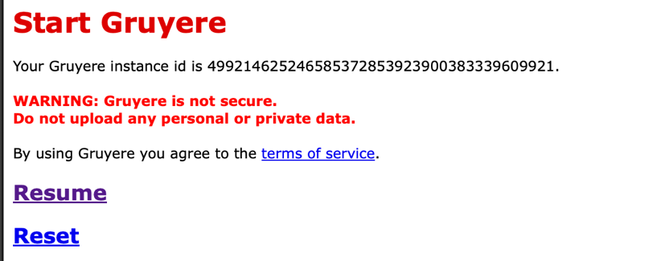
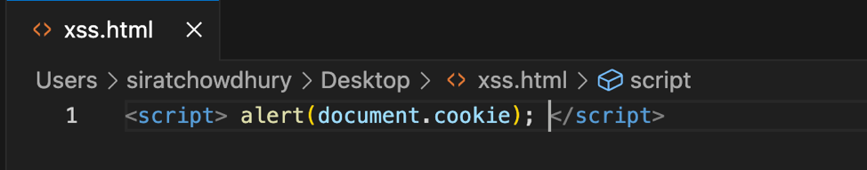
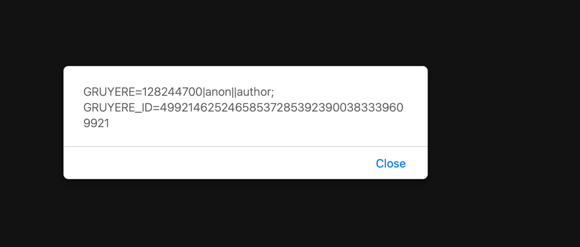
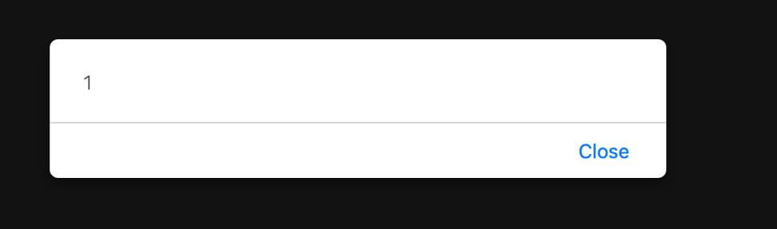
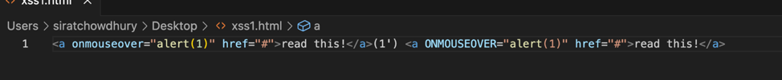
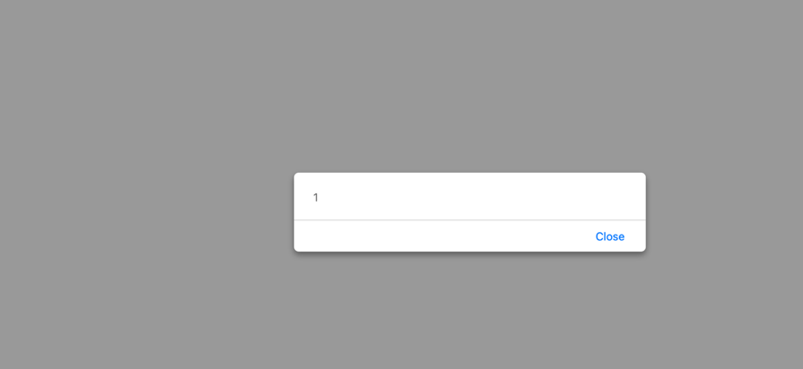
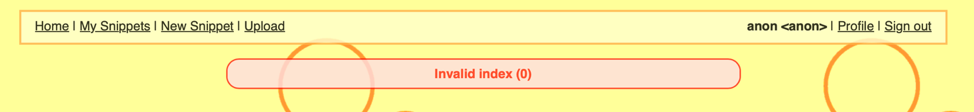

# Web Security

## Part 1 – Experiment with the Gruyere Platform

## Attack Type: File Upload (XSS)

### Step Taken & Payload:

### Result:

### Countermeasures from codelab website:

One countermeasure that’s mentioned in the website is to store it on a separate subdomain (like username.usercontent.example.com) instead of storing user content on main website (like example.com/username). Using a name like "usercontent" also helps prevent attackers from creating deceptive names that might look safe.

**Additional countermeasure:**

Another countermeasure that could be taken to prevent this is to validate the file type. For example, only let users upload certain kinds of files such as .jpg or .png. and check that if the file is really an image and not something dangerous like an html or script file.

## Attack Type: Reflected (XSS)

### Step Taken & Payload:

Searched `https://google-gruyere.appspot.com/499214625246585372853923900383339609921/` on browser

### Result:

### Countermeasures from codelab website:

A countermeasure that is mentioned in the website is to escape user input that is displayed in error messages. Error messages are displayed using , but are not escaped in the template. The part of the template that renders the message is `{{message}}` and it's missing the modifier that tells it to escape user input. Add the :text modifier to escape the user input: `
{{_message:text}}
`

**Additional countermeasure:**

instead of displaying the raw user input in the error output, you could replace it with a generic error message like: `
An error occurred.
` This approach prevents any injected script from being executed.

## Attack Type:  Stored (XSS)

### Step Taken & Payload:

### Results:

Once I hovered over the link I get this alert:

Various countermeasures from codelab website:

- Convert the input into a well-formed DOM structure so that the browser’s lenient parsing is not relied upon.

- Only allow a defined set of safe tags and attributes rather than trying to block a list of dangerous ones.

- Carefully sanitize any values for attributes like `href`, `src`, and `style` to ensure they don’t contain executable code.

- Whenever possible, utilize established HTML sanitization libraries that have been thoroughly tested for security.

**Additional countermeasure: One approach would be to treat users input as plain text. This means converting characters like < and > into harmless symbols (like &lt; and &gt;) so that any code they try to insert is shown as text instead of being run by the browser.**

## Attack Type:  (XSRF)

### Step Taken & Payload:

Searched `https://google-gruyere.appspot.com/499214625246585372853923900383339609921/deletesnippet?index=0` on the browser

### Result:

Various countermeasures from codelab website:

- Change state-changing actions to use `POST` requests, not `GET`.

- The token should be linked to the specific action (like the URL) so it can’t be used for a different request.

- Make the token expire quickly (only a few minutes), so it can’t be reused over a long period.

- The token must be unique and unpredictable, built from the user's cookie, the current time, and the specific action.

**Additional countermeasure: Instead of immediately executing a delete when a request is made, you could have the application display a confirmation dialog (like a JavaScript confirm box). This step forces the user to manually approve the action, which makes it harder for an attacker to trigger the action automatically without the user's knowledge.**

# Part 2 – Open Research on AI and Security

## How can artificial intelligence (AI) be leveraged to enhance cybersecurity, and what are the potential risks or vulnerabilities introduced by relying on AI-based systems?

AI helps improve cybersecurity by automatically spotting threats. It can quickly analyze huge amounts of data to find signs of suspicious activity, such as unusual login patterns, and then alert security teams or even block attacks on its own.

However, there are risks too. Hackers can try to trick AI systems by feeding them false or misleading data, which might cause the AI to miss the actual threats or flag harmless actions as dangerous. While AI is a powerful tool, it shouldn't be the only defense, we still need human monitoring and traditional security measures.
